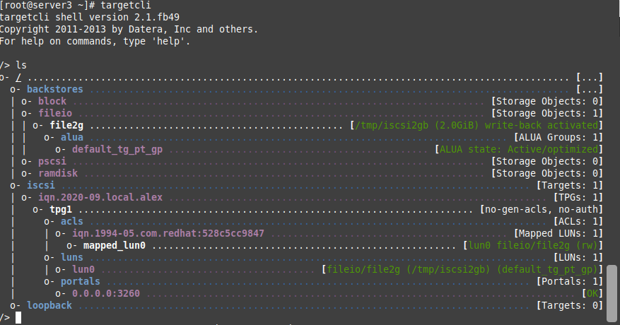

1. **(ВЫПОЛНЕНО)** Собрать схему из трёх серверов. Два сервера должны иметь как минимум 3 сетевых адаптера. Один сервер должен иметь 2 сетевых адаптера.
2. **(ВЫПОЛНЕНО)** Первый интерфейс на каждой виртуальной машине имеет режим подключения bridge (сетевой мост) или nat для предоставления доступа в интернет и по ssh из родительской операционной системы. В этом примере используется bridge, так как есть роутер провайдера, который раздает IP-адреса.
3. **(ВЫПОЛНЕНО)** Все последующие интерфейсы между серверами организуют отдельные изолированные сегменты. Режим подключения — LAN Segment. Делается это, чтобы изолировать коммуникацию между сетевыми адаптерами устройств.
4. **(ВЫПОЛНЕНО)** Настроить любой из интерфейсов между  server1 и server2. Назначить на него адреса из подсети 192.168.12.0/24. Второй интерфейс между ними остается отключенным и в этом задании не участвует.
5. **(ВЫПОЛНЕНО)** Настроить подсеть между server2 и server3 с адресами из подсети 192.168.23.0/24.
6. **(ВЫПОЛНЕНО)** На каждом из серверов поднять dummy0-интерфейс и назначить на него ip-адрес 1.1.1.1/32, 2.2.2.2/32, 3.3.3.3/32 соответственн

**/etc/modprobe.d/dummy.conf**

    options dummy numdummies=1

**/etc/modules-load.d/dummy.conf**

    # Load dummy.ko at boot
    dummy

**/etc/sysconfig/network-scripts/ifcfg-dummy0**

    DEVICE=dummy0
    IPADDR=1.1.1.1
    PREFIX=32
    NM_CONTROLLED=no
    ONBOOT=yes

7. **(ВЫПОЛНЕНО)** На серверах установить пакет frr и настроить на роутерах ospf, добавив подсети 192.168.12.0/24,  192.168.23.0/24, 1.1.1.1/32, 2.2.2.2/32, 3.3.3.3/32 в area 0.

        Current configuration:
        !
        frr version 7.4
        frr defaults traditional
        hostname server2
        !
        router ospf
        network 2.2.2.2/32 area 0
        network 192.168.12.0/24 area 0
        network 192.168.23.0/24 area 0
        !
        line vty
        !
        end
        server2# 

8. **(ВЫПОЛНЕНО)** Убедиться, что маршрутизация работает, и с server1 вы должны пинговать 3.3.3.3 адрес на server3. Убедитесь, что нужный тип трафика разрешен в firewalld и что трафик не улетает в интернет при помощи traceroute.

        [root@server1 ~]# traceroute 3.3.3.3
        traceroute to 3.3.3.3 (3.3.3.3), 30 hops max, 60 byte packets
        1  192.168.12.2 (192.168.12.2)  0.335 ms  0.224 ms  0.148 ms
        2  3.3.3.3 (3.3.3.3)  0.375 ms !X  0.274 ms !X  0.215 ms !X

9. **(ВЫПОЛНЕНО)** На server3 создайте 2 папки nfs_1 и nfs_2, добавьте их в export.
10. **(ВЫПОЛНЕНО)** Убедитесь, что только server1 может их примонтировать.
11. **(ВЫПОЛНЕНО)** Убедитесь, что после перезагрузки server1 все еще может писать и читать файлы в примонтированных папках
12. **(ВЫПОЛНЕНО)** На server3 создайте iSCSI target размером 2GB и примонтируйте этот LUN на server1. 

